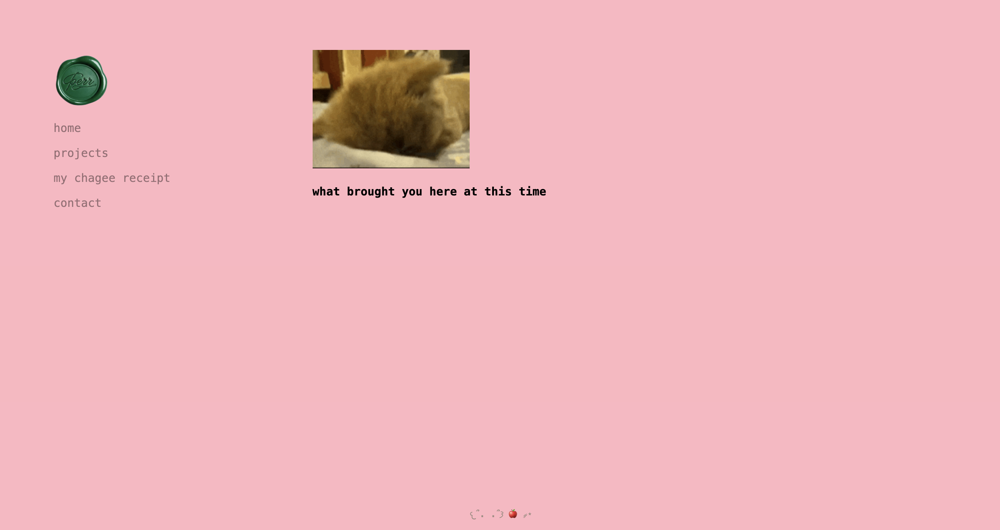

# Housetour

My personal website at [here!](https://perr.dev), it is made with HTML, CSS, JavaScript, and use [Turbo](https://turbo.hotwired.dev) for component and page navigation.

# Notable File
- [content/sidebar.html](content/sidebar.html) - The sidebar component that is used in all pages
- [asset/css/font.css](asset/css/font.css) - The font styles for the website
- [asset/css/index.css](asset/css/index.css) - The main styles for the website
- [asset/css/sidebar.css](asset/css/sidebar.css) - The styles for the sidebar component
- [asset/js/apple-credit.js](asset/js/apple-credit.js) - The script for launching confetti effect in the footer when clicks on the apple

# Credit
- [Turbo](https://turbo.hotwired.dev)
- [Tenor](https://tenor.com) for GIFs
- [Favloader](https://github.com/jcubic/favloader) for animated favicon
- [TsParticles](https://github.com/tsparticles/tsparticles) for confetti effect in the footer
- [Chagee App](https://chagee.com) as the data for my receipt page
- [iBooks Template](https://www.figma.com/community/file/1221910634878137862/ibooks-template) for my projects shelf
- [Paper Shaders](https://shaders.paper.design/) for my unused shader experiments but the heatmap is in the zolt book tho